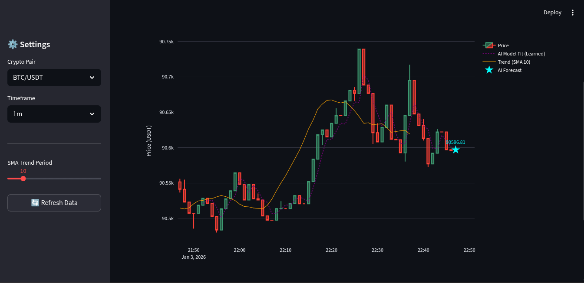
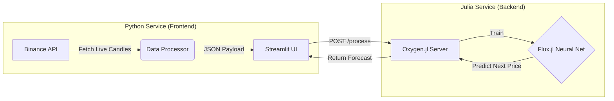

# ⚡ CryptoPulse: Polyglot AI Forecasting (Python + Julia)


A high-frequency market forecasting engine demonstrating a **Polyglot Microservice Architecture**. It combines **Python's** rich ecosystem for data fetching/visualization with **Julia's** high-performance computing capabilities for real-time Neural Network training (Flux.jl).


> *Note: Market data timestamps are displayed in **UTC** to maintain industry standards for financial engineering.*

## 🏗️ Architecture

The system is composed of two containerized services communicating via HTTP (REST API).



## 🚀 Key Features
- Hybrid Compute: Offloads heavy mathematical operations (SMA, Neural Networks) to a dedicated Julia microservice.

- Online Learning: The AI model (Flux.jl) retrains instantly on the latest market window received using an explicit training loop.

- Visual Validation: Includes real-time curve fitting visualization to verify if the model is learning temporal patterns vs. random noise.

- Resilient: Implements timeouts and error handling for robust microservice communication.

- CI/CD: Automated testing pipeline for both Python (pytest) and Julia (Test.jl) environments via GitHub Actions.

## 🛠️ Tech Stack
- Frontend: Python 3.11, Streamlit, Plotly, CCXT (Data Fetching).

- Backend: Julia 1.10, Oxygen.jl (API), Flux.jl (Deep Learning), TimeSeries.jl.

- Infra: Docker & Docker Compose.

## 🏃‍♂️ How to Run
You don't need to install Python or Julia locally. Just Docker.

``` bash
# 1. Clone the repository
git clone https://github.com/luizgdev/cryptopulse-forecasting.git
cd cryptopulse-forecasting

# 2. Start the Application
docker-compose up --build
```
Access the dashboard at: http://localhost:8501

## 🧪 Testing
This project includes a dual-language testing suite ensuring integrity across the stack.

``` bash
# Run Python Tests (Frontend Integration)
cd python_service
pytest

# Run Julia Tests (Backend Logic)
cd julia_service
julia test/runtests.jl
```
---
*Developed as a Polyglot Architecture Portfolio Project.*
